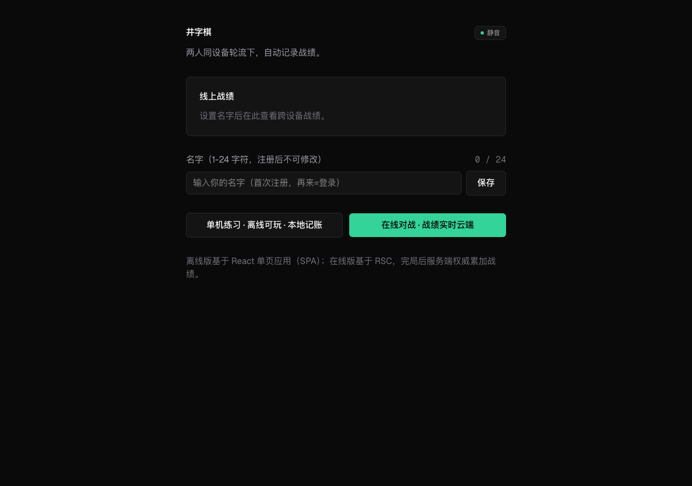
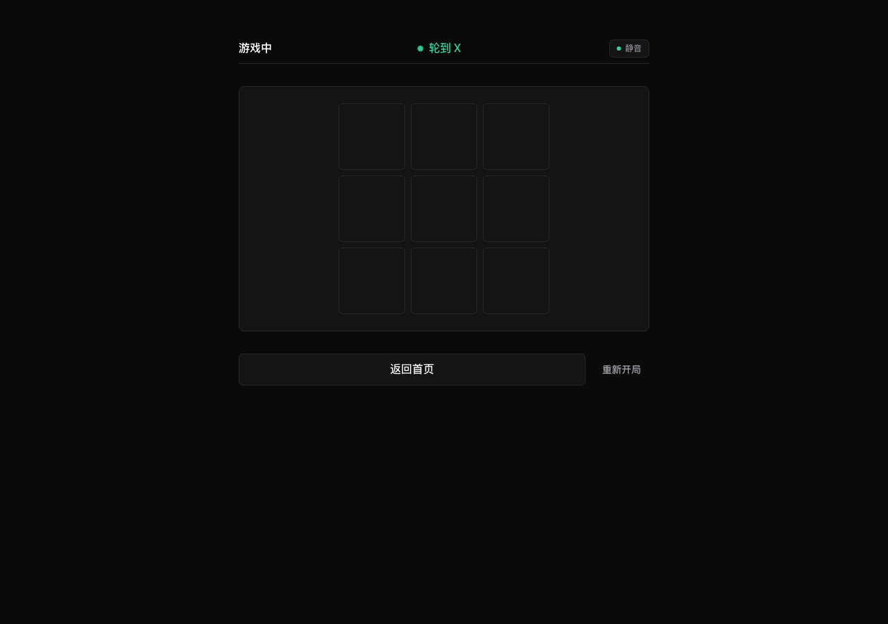
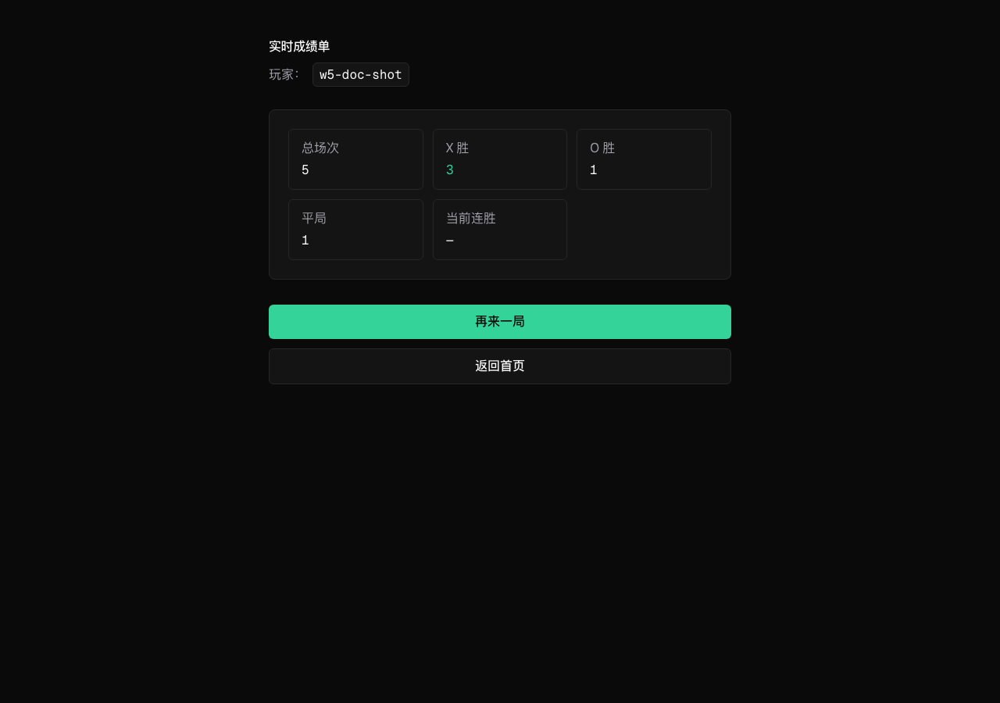
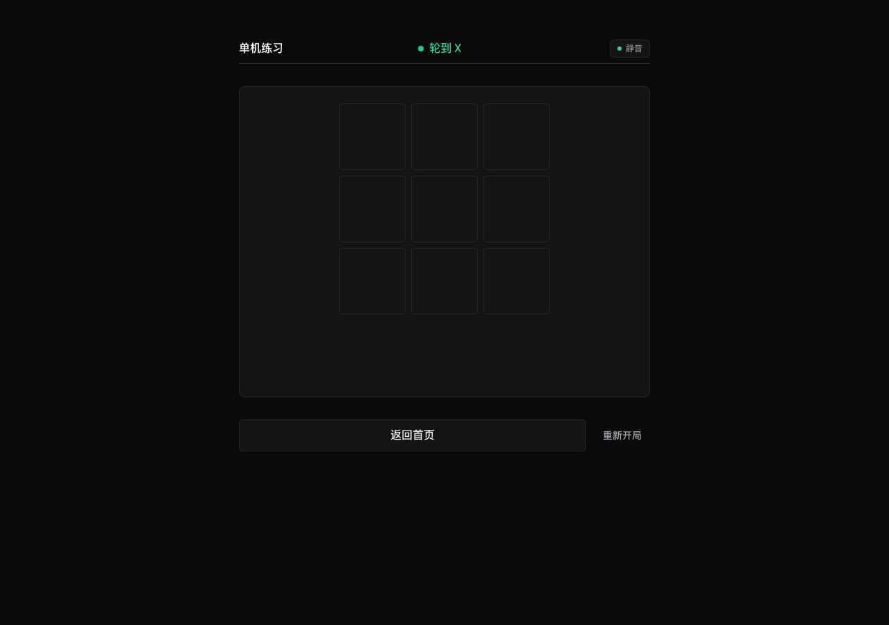

# tic-tac-toe

一局棋两版本（offline 纯本地 / online 实时上服）+ RESTful API 的井字棋。

| 展示页 | online 棋盘 | result 成绩单 | offline 棋盘 |
| --- | --- | --- | --- |
|  |  |  |  |

文件名沿用旧命名（`board.png` 现在对应 `/online`，`solo.png` 现在对应 `/offline`），便于 PR diff 与既有截图素材复用；路由语义以正文为准。

W3 房间术语迁移后，本仓的「房间」= 这台设备上这组人的战绩账本标识（同设备 pass-and-play 语义）。在线模式 = 账本在云端的房间（房间名定位账本，跨设备续记）；离线模式 = 账本在本地的房间（线下面对面游玩空间）；合并弹框 = 把线下账本并入云端同名房间。详见 [`.omo/plans/ulw-room-migration-home-landing.md`](.omo/plans/ulw-room-migration-home-landing.md)。

## Quick start

1. `git clone <this-repo> && cd tic-tac-toe`
2. `pnpm install`
3. `pnpm dev` → http://localhost:3000
4. 完成——本地开发不需要 `.env.local`、不需要任何 env vars；战绩自动持久化
   到本地 sqlite：`data/tic-tac-toe.db`。

## 一局棋两版本

本仓的产品模型（[`.omo/plans/ulw-one-game-two-versions.md`](.omo/plans/ulw-one-game-two-versions.md) §0）是「同一局棋，两个版本」。首页是引导页（hero + 玩法引导 + 双入口 CTA + 战绩静态入口 + 合并弹框宿主 + 房间弹框宿主），用户按意图选择：

### `offline`（SPA · 纯本地 · 单机练习）

- 路由 `/offline`（React 客户端组件，自带 view-swap 棋盘↔战绩切换）。
- **100% 纯本地**：完全离线、本地账本、不发任何 fetch；完局战绩落 `localStorage['ttt.offline.stats.v1']`。
- **无名不记**：未在首页进入过在线房间的玩家在 `/offline` 玩的对局不进入战绩账本（落子、胜平动画仍正常，体验反馈完整）。
- 页内完局：胜平自动切战绩视图 + 彩纸（W3 result-paginated）。
- **唯一网络写**：跨设备合并走首页 `HomeDialogMount` 弹框（`pendingSyncCount() > declinedSentinel` 才开 dialog，否则静默直行）；弹框主 CTA「合并并清空」→ `POST /api/rooms` + `POST /api/rooms/{room}/stats/merge`，副 CTA「保留本地」零网络写。

### `online`（RSC · 实时上云 · 在线对战）

- 路由 `/online` → 完局自动推 `/result?room=<roomName>`；`/result` 是 RSC 实时成绩单（`dynamic='force-dynamic'`，读 `lib/db.ts:loadRecordByRoom`）。
- **需 roomName**：入口拦截（`StartGameButton` `requireName` + `RoomGateMount`）—— 无名点击 online 不导航，dispatch `ttt:room-required` Window CustomEvent，`RoomGateMount` 监听打开 `RoomGateDialog` 收名（成功后写 `ttt.room.name.v1` + store，再 `startGame + push('/online')`）。
- **同设备对战**：本仓无远程联机——`/online` 与 `/offline` 都是 pass-and-play（同设备轮流下），区别只在记账位置（云端 / 本地）。`/online` 与 `/offline` 页内文案注明「同设备对战」，防「在线=远程联机」误解。
- **服务端权威累加**：完局 `POST /api/rooms/{room}/stats/outcomes` → server `recordOutcomeForRoom` 累加 → `/result` 渲染实时行。
- 战绩跨设备一致：服务端是单一真源，本机只渲染只读视图。

### 首页 = 引导页

`app/page.tsx` 是项目的引导页（W3 D-1 决议）：

- **hero**：`<h1>井字棋</h1>` + 副标「两人同设备轮流下，自动记录战绩」
- **玩法引导区**（新，纯 RSC 静态）：轮流落子 · 三连即胜 · 同设备传递（pass-and-play 说明）
- **双 CTA**：
  - 线下房间 · 面对面同设备 · 本地记账 → `/offline`（`requireName=false`，永远直行）
  - 在线房间 · 同设备对战 · 战绩云端 → `/online`（无名 → `RoomGateDialog`；有名 → `startGame + push`）
- **战绩静态入口**（新）：有 `roomName` 时渲染「查看 `<room>` 的战绩 →」链接去 `/result?room=<roomName>`（纯 `<Link>`，零请求，组件 `HomeStatsEntry`）；无名时不渲染。
- **`HomeDialogMount`**（保留，房间术语化）：跨设备合并弹框 mount effect，监听 `ttt:offline-stats-changed` / `focus` / `visibilitychange` / `storage`，`pendingSyncCount() > declinedSentinel` 才开 `SyncConfirmDialog`
- **`RoomGateMount`**（新挂载）：监听 `ttt:room-required`，打开 `RoomGateDialog`；同时执行挂载期 identity bootstrap（localStorage `ttt.room.name.v1` → store）+ `cleanupLegacyPlayerNameKey()` 一次性 legacy 清除（cace8f4 修补 W2 删除 PlayerNameForm 的反向 hydration 缺口）
- `<script type="application/ld+json">`（schema.org `VideoGame` + `WebApplication` + `playMode: MultiPlayer` + `applicationCategory: Game` + `offers(price 0)`）—— JSON-LD 是 AI / 搜索引擎的结构化数据展示点，首页源码里可直读

首页零 `/api/*` 请求（A1 红线，`one-identity-qa` Q1 step 硬断言）；战绩展示主场归 `/result` RSC。

## Features

- 🎯 **一局棋两版本**：offline（SPA、纯本地、唯一网络写是合并弹框） + online（RSC、服务端权威累加、`/result` 实时成绩单）；首页为引导页（hero + 玩法引导 + 双 CTA + 战绩静态入口）。
- 🏷️ **房间账本模型**（W3）：本仓的「房间」= 这台设备上这组人的战绩账本标识。`game_stats.room TEXT UNIQUE` 是单行表（per-room，本地 file: sqlite / Vercel Turso HTTP）；offline 走 `localStorage['ttt.offline.stats.v1']`。两账本严格不混。
- 🌒 **暗色优先**：基于 Tailwind v4 设计令牌，桌面优先，移动端可用但非目标。
- ⌨️ **键盘优先**：棋盘使用 roving focus——Tab 入盘，↑↓←→ 移焦邻格，Enter/空格落子，游玩无需鼠标。
- 🔇 **音效懒加载**：AudioContext 仅在用户首次手势后创建，默认关闭且持久化。
- ✨ **彩纸无障碍**：`prefers-reduced-motion` 下走无动效路径，data-testid 稳定。
- 🎞️ **页面过渡**：四页路由切换由 React 19 `<ViewTransition>` 驱动双向 crossfade，旧浏览器自动降级为无过渡。
- 🧪 **Gauntlet 测试栈**：vitest + fast-check（属性）+ Stryker（突变）+ commitlint + commit-audit，强制单测 80% 行 / 70% 分支。
- 🚀 **Vercel-ready**：`@libsql/client` 的 http(s) 分支在 Vercel serverless 上直接连 Turso，零原生模块、零 fs 依赖。

## 路由

| Route | 说明 |
| --- | --- |
| `/` | 引导页：hero + 玩法引导 + 双 CTA + 战绩静态入口（纯 `<Link>`）+ 合并弹框宿主 + 房间弹框宿主；零 `/api/*` 请求（A1 红线） |
| `/online` | 在线对局（pass-and-play）：3x3 棋盘 + 当前玩家指示 + 重新开局；完局自动推 `/result` |
| `/offline` | 单机练习（pass-and-play）：3x3 棋盘 + 单机战绩面板（无名不记、零网络写、唯一网络写是合并弹框）+ 完局自动切战绩视图 |
| `/result?room={trimmed}` | 实时成绩单（RSC）：按房间名读 `game_stats` 行，渲染 StatsGrid + 再来一局 + 返回首页；旧 `?name=` 走 fallback（portfolio 无保留价值） |

## RESTful API 参考

四个端点均按 [AIP-136](https://google.aip.dev/136) / [RESTfulAPI.net](https://restfulapi.net/) 范式设计，统一 RFC 9457 `application/problem+json` 错误响应（`lib/api-problem.ts`）。

| 方法 + 路径 | Body | 200/2xx 响应 | 错误（problem+json） |
| --- | --- | --- | --- |
| `POST /api/rooms` | `{ room }` | `200 { stats, existed }` —— 进入房间幂等（`existed:false` 新建空行，`existed:true` 返回既有行） | `400 invalid-json` / `422 invalid-request-shape` / `422 invalid-room-name` / `500 db-unavailable` |
| `GET /api/rooms/{room}/stats` | — | `200 { stats }` —— 服务端权威按房间名查 row | `404 stats-not-found` / `422 invalid-room-name` / `500 db-unavailable` |
| `POST /api/rooms/{room}/stats/merge` | `{ stats }` | `200 { stats }` —— 服务端 `load → accumulateMergeStats per-field 相加 → upsert` | `409 enter-room-required`（防静默建档）/ `400 invalid-json` / `422 invalid-request-shape` / `422 invalid-room-name` / `500 db-unavailable` |
| `POST /api/rooms/{room}/stats/outcomes` | `{ outcome: 'X' \| 'O' \| 'draw' }` | `200 { stats }` —— 服务端 `load → recordOutcome → upsert`（`lib/db.ts:recordOutcomeForRoom`） | `404 stats-not-found`（防静默建档）/ `400 invalid-json` / `422 invalid-request-shape` / `422 invalid-room-name` / `500 db-unavailable` |

### problem+json 错误形态

所有 4xx/5xx 错误响应统一为 RFC 9457 `application/problem+json`：

```http
HTTP/1.1 409 Conflict
Content-Type: application/problem+json

{
  "type": "https://docs.example.com/probs/enter-room-required",
  "title": "Enter room required",
  "status": 409,
  "detail": "No row for room \"alice\". Enter or create the room before merging."
}
```

`type` 字段是稳定的 https 形态短 URI（`lib/api-problem.ts:TYPE_BASE + slug`），客户端按 type 分支而非爬文案。已登记的 slug：`stats-not-found` / `enter-room-required`（对齐 CONTEXT.md「进入房间」动词；W-C D-5b 自 W1 player 术语迁移）/ `invalid-room-name` / `invalid-request-shape` / `invalid-json` / `method-not-allowed` / `db-unavailable`。

### 客户端调用方

- `lib/game-net.ts` —— 浏览器 HTTP 薄壳（4 个函数 + 8s `AbortController.timeout()` + `{ ok, value } | { ok: false, reason }` 契约）。
- `RoomGateDialog` → `postRoomSession`
- `/result?room=` RSC → `fetchRoomStats`（404 翻译为 `{ stats: null }`，展示层零分支）
- `SyncConfirmDialog` → `postRoomSession` + `postMerge`（合并时先进入房间再合并）
- `lib/store.ts:apiRecordOutcome` → `postOutcome`（online 分支的写动作）

### 已退役的端点（历史叙述）

`/api/stats`、`/api/stats/outcome`、`/api/solo-stats`、`/api/solo-stats/sync`、`/api/player-session` 在 W1-W2 整体退役；`/api/sessions`、`/api/players/{name}/stats{*,/outcomes,/merge}` 在 W3 整体退役（房间术语迁移）。`/api/stats` 链（GET/PUT/DELETE 全行族）随 ranked 单行（id=1, name=NULL）一起退役；`/api/solo-stats/*` 链随 solo by-name 路径整体被 W1 RESTful 四端点取代；`/api/sessions` 与 `/api/players/*` 链随 W3 房间概念整体被现 `/api/rooms/*` 取代。历史 commit 锚定见 [`.omo/plans/ulw-one-game-two-versions.md`](.omo/plans/ulw-one-game-two-versions.md) §0 / §2 与 [`.omo/plans/ulw-room-migration-home-landing.md`](.omo/plans/ulw-room-migration-home-landing.md) §1。

## GraphQL 双兼容预留（service 层 / 传输层 强制分离契约）

`lib/db.ts` 是 **service 层**，所有「读 / 改 / 写战绩」业务规则收敛为纯函数（无 HTTP 上下文、无 `NextResponse`、无 status code 知识）。调用方是浏览器端 `lib/store.ts` 或 Node runtime 端 `app/api/**/route.ts`。

**强约束**（自 W2 `ulw-one-game-two-versions.md` §0 起，传输层必须遵守）：

1. service 函数返回值必须是「数据 + 状态标记」的纯数据形式：
   - 命中：返回 `GameStats`（或 `{ stats, ... }` 等纯对象）；
   - 缺失：返回明确的 `null` 或具名 `not-found` 标记字符串；
   - 异常：抛 `Error`（调用方 try/catch 后翻译成 problem+json）。
   **禁止**返回 `Response` / `NextResponse` / `{ status: 404 }` 等传输层对象。
2. service 函数不读 `Request` / `headers` / `URL.searchParams`；解析工作归传输层。
3. service 函数不写日志、不打 console；调用方负责 observability。
4. 任意 transport（RESTful route / **GraphQL resolver** / gRPC handler）只应：
   - 解析入参 → 调用 service → 把 service 返回值映射到自己的 status code / problem+json / GraphQL error / gRPC status；
   - **不得**在 transport 里再写一份「read → mutate → upsert」业务规则。

**GraphQL 双兼容**：未来若引入 GraphQL 端点，**只需新增 schema + resolver**，service 函数零改动。`registerOrLoginRoom` / `loadRecordByRoom` / `mergeRecordByRoom` / `recordOutcomeForRoom` / `accumulateMergeStats` 等已是 service 层单一真相。

## 词汇语义说明

本仓使用 **schema.org** 词汇表对齐的版本命名——`offline` / `online`（连接性维度）而非 `single` / `multi`（参与人数维度）：

| 维度 | schema.org 枚举 | 本仓映射 | 备注 |
| --- | --- | --- | --- |
| 参与人数 | `GamePlayMode: SinglePlayer / MultiPlayer / CoOp` | `MultiPlayer`（两位同设备 pass-and-play） | 单一真值，与连接性正交 |
| 连接性 | — | `offline`（无网络）/ `online`（实时上云） | 本仓产品维度的二选一 |
| 账本标识 | — | 「房间」= 这台设备上这组人的战绩账本标识（W3 D-3 御定术语迁移） | 单行 `game_stats.room TEXT UNIQUE` |
| 游戏类型 | `@type: VideoGame` + `applicationCategory: Game` + `gamePlatform: Web Browser` | 首页 `<script type="application/ld+json">` 直读 | AI / 搜索引擎结构化数据 |
| 价格 | `offers.price: 0` + `priceCurrency: CNY` | — | 免费、无内购 |
| 玩家数 | `numberOfPlayers: { minValue: 1, maxValue: 2 }` | — | 桌面 / 移动统一 |

**为何不沿用 `single / multiplayer`**：`single` 在 `GamePlayMode` 上下文里是「单人对系统」（即单人 vs AI），但本仓棋盘是两人同设备 pass-and-play（无 AI 对手），语义错位。`MultiPlayer` 表达「两人或多人互相对战」准确。本仓二选一维度（offline / online）是 **连接性**（是否实时上服），与 **参与人数** 正交——故按连接性命名，schema.org 词汇表对接位置在 `MultiPlayer` + `VideoGame.playMode`。

**为何 `solo / ranked` 已退役**：旧版本用 `solo` / `ranked` 二分，`solo` 撞车 schema.org `SinglePlayer`（与本仓实际模型冲突），`ranked` 暗含「排位」语义（本仓并无天梯/匹配，只是房间账本）。W1 御定替换为 `offline / online`（参 plan §1）。

**为何「name / 玩家名 / 注册 / 登录」已退役（W3 D-3）**：本仓两种模式都是同设备对战（pass-and-play，Wiktionary：「通过传递设备轮流游玩」），X/O 两个玩家的胜负全记在同一个账本标识下。所以账本标识从来不是「对战中的玩家身份」，而是「这台设备上这一组人的战绩账本标识」——「房间」是准确概念（plan §0.1-4）。W3 一步到位迁移到 `room` / 「房间」/`/api/rooms`/`ttt.room.name.v1`（用户可见文案「房间名 / 创建房间 / 进入房间」）。旧 `ttt.player.name.v1` 启动期被 `cleanupLegacyPlayerNameKey` 单向清空，不迁移数据（D-4 许可）。

## localStorage key 表

W3 起本地账本只认以下 key：

| Key | 用途 | 来源 / 写入方 |
| --- | --- | --- |
| `ttt.room.name.v1` | 当前 roomName（W3 唯一） | `lib/room-name.ts:ROOM_NAME_KEY`，由 `RoomGateDialog` 提交成功后 + `RoomGateMount` 挂载期 identity bootstrap 写入 |
| `ttt.offline.stats.v1` | offline 局本机战绩账本（per-room） | `lib/offline-stats.ts:OFFLINE_STATS_KEY` |
| `ttt.offline.last-merged-local.v1` | 合并基线哨兵——「合并完成时本机零位」基线（W4 F1 模型） | `lib/offline-stats.ts:OFFLINE_LAST_MERGED_LOCAL_KEY`，由 `HomeDialogMount.handleConfirm` 合并成功后写 0 |
| `ttt.offline.sync-declined.v1` | 防重弹哨兵——「保留本地」后同会话不重弹（sessionStorage，关标签页即忘） | `components/HomeDialogMount.tsx` 在 onReject 时写 pending 快照 |

### 已退役的 key（历史叙述）

W1-W4 改造后，旧 `ttt.solo.*` 三 key 全部弃用，**不迁移**（新用户/旧用户皆直接用新 key，旧 key 残留不影响功能）：

| 旧 key | 替代 | 状态 |
| --- | --- | --- |
| `ttt.solo.stats.v1` | `ttt.offline.stats.v1`（`lib/offline-stats.ts:OFFLINE_STATS_KEY`） | 弃用不迁移 |
| `ttt.solo.server.synced.v1` | `ttt.offline.last-merged-local.v1`（W4 F1 fix 改基线模型） | 弃用不迁移；helpers 保留为 `@deprecated` 仅供旧测试 surface |
| `ttt.solo.sync-declined.v1` | `ttt.offline.sync-declined.v1`（`components/SyncConfirmDialog.tsx:SYNC_DECLINED_KEY`） | 弃用不迁移；sessionStorage 哨兵同语义 |
| `ttt.player.name.v1` | `ttt.room.name.v1`（W3 迁移） | **W3 启动期被 `cleanupLegacyPlayerNameKey` 单向清空，不迁移数据**；`LEGACY_PLAYER_NAME_KEY` 常量保留在 `lib/room-name.ts` 仅供测试 surface |

## 本地开发

```bash
pnpm install
pnpm dev              # http://localhost:3000
pnpm build && pnpm start
```

> **已知问题 / Known issue**：macOS 上 `pnpm dev` 冷启可能撞 Watchpack `EMFILE` 风暴（约 668 次失败 + `.next/dev` deleted 重启环），系上游 [vercel/next.js#93175](https://github.com/vercel/next.js/issues/93175) OPEN 未修（watchpack 逐目录 watch × pnpm 目录农场 × macOS FSEvents 上限；非 fd 耗尽）。临时止血：`WATCHPACK_POLLING=true pnpm dev`。重启 dev 前先关闭指向 :3000 的旧标签页（每页持有一条 HMR websocket，服务复活瞬间同时重连会放大故障）。详见 `AGENTS.md` §本项目反模式。

默认 `DATABASE_URL=file:./data/tic-tac-toe.db`，数据落在 `data/tic-tac-toe.db`。
**首次 clone 后不需要建 `.env.local`** — `lib/db.ts` 默认走
`file:./data/tic-tac-toe.db` 嵌入式 sqlite（`@libsql/client` 自带）。
`.env.example` 仅在你切到 Turso 或自定义路径时才需要复制。
HTTP 部署详见下方「部署」章节。

想用真实 Turso 库联调？参见 [本地联调 Turso 指南](docs/local-turso-setup.md)。

## Gauntlet 工具链

| 层 | 工具 | 命令 |
| --- | --- | --- |
| 单元 / 属性测试 | vitest + fast-check | `pnpm test` |
| 类型检查 | tsc (strict) | `pnpm typecheck` |
| Lint | eslint (next) | `pnpm lint` |
| Coverage | v8 (per-file) | `pnpm test:coverage` |
| Mutation | Stryker (scoped to `lib/` + `db/`) | `pnpm test:mutation` |
| 构建 | Next.js 16 (Turbopack) | `pnpm build` |
| E2E 视觉 | Playwright (vs `pnpm start`) | `node tests/qa/visual-qa.mjs` |

阈值在 `vitest.config.ts` 里：lines / functions / statements 80%，branches 70%。

## 目录结构

```
app/                  App Router 路由 + RESTful API route handlers
  layout.tsx          字体 (Geist / Geist Mono) + 暗色基底 + JSON-LD
  page.tsx            引导页 (Client)：hero + 玩法引导 + 双 CTA + 战绩静态入口 + 弹框宿主
  online/page.tsx     在线对局 (Client)：完局推 /result
  offline/page.tsx    单机练习 (Client)：纯本地，棋盘↔战绩 view-swap
  result/page.tsx     实时成绩单 (RSC)：按 ?room= 读 game_stats 行
  api/rooms/route.ts                                  POST 进入房间幂等 {stats,existed}
  api/rooms/[room]/stats/route.ts                     GET 按房间名查 row (200/404)
  api/rooms/[room]/stats/merge/route.ts               POST 跨设备 per-field 累加 (200/409)
  api/rooms/[room]/stats/outcomes/route.ts            POST 在线版记一局 (200/404)
  globals.css         @theme tokens, 暗色基底
components/           Board + 棋盘/弹框/战绩客户端组件，以及 ui/ 基础组件
db/schema.ts          Drizzle schema (game_stats 单行表，room TEXT UNIQUE)
lib/
  game.ts             纯函数: 棋盘/胜负/可用格/先手随机/战绩累计
  game.test.ts        单元 + fast-check 属性测试 (同目录)
  db.ts               service 层：@libsql/client + Drizzle（file:/http(s): 自适应）；纯函数，零 HTTP 上下文
  store.ts            Zustand store: phase/board/currentPlayer + game-net 同步 + mode='online'|'offline' + roomName
  game-net.ts         浏览器 HTTP 薄壳：postRoomSession/fetchRoomStats/postMerge/postOutcome (8s AbortController)
  api-problem.ts      RFC 9457 problem+json helper
  offline-stats.ts    localStorage 持久化（OfflineStatsPanel 数据源）+ 哨兵
  room-name.ts        房间白名单 normalizeRoom (server-side 单一真相) + getRoomName/setRoomName/clearRoomName + cleanupLegacyPlayerNameKey
  home-jsonld.ts      schema.org JSON-LD payload + Next.js 16 XSS-safe 字符串化
data/                 本地 SQLite 文件 (gitignored)
reports/mutation/     Stryker html + json 报告 (gitignored)
coverage/             v8 coverage html 报告 (gitignored)
tests/qa/             Playwright 视觉 + 提交审计 + one-identity-qa 整合探针
public/               静态资源 (logo / favicon / social-card)
```

## 文档导航

| 文档 | 内容 |
| --- | --- |
| [DESIGN.md](DESIGN.md) | 设计契约：色彩 / 字体 / 间距 / 动效 / 可访问性 token；§Modes 描述两版本 |
| [AGENTS.md](AGENTS.md) | AI 代理与贡献规范：commit 约定、门禁、验证 gate；代码地图已正名 offline/online + 房间概念 |
| [CONTRIBUTING.md](CONTRIBUTING.md) | 提交流程与本地开发 quick start |
| [CODE_OF_CONDUCT.md](CODE_OF_CONDUCT.md) | Contributor Covenant 3.0 |
| [SECURITY.md](SECURITY.md) | 私有漏洞披露渠道 |
| [docs/testing.md](docs/testing.md) | 测试思路：分层策略、阈值、RED-first、QA 探针设计 |
| [docs/operations.md](docs/operations.md) | 操作手册：日常命令、DB、QA、提交规范速查、排错 |
| [docs/learnings.md](docs/learnings.md) | 学习笔记：踩坑记录与版本相关事项 |
| [docs/branching.md](docs/branching.md) | 分支策略：trunk-based、双 Ruleset、协作演进 |
| [.omo/plans/ulw-one-game-two-versions.md](.omo/plans/ulw-one-game-two-versions.md) | 双版本 + RESTful + schema.org 词汇对齐的成文产品计划 |
| [.omo/plans/ulw-room-migration-home-landing.md](.omo/plans/ulw-room-migration-home-landing.md) | W3 房间术语一步到位迁移 + 首页引导化计划 |

## FAQ

**怎么切到 Vercel 持久化？** 默认 `DATABASE_URL=file:./...` 在 Vercel serverless
上是临时 fs，不会持久。把 `DATABASE_URL` 改成 `https://<db>.turso.io`（或
`libsql://<db>.turso.io`），并设置 `DATABASE_AUTH_TOKEN=<turso-issued-token>`。
`lib/db.ts` 会自动走 http(s) 分支，不再碰文件系统和原生 sqlite。详见下方「部署」。

**能离线玩吗？** 走棋可以（前端规则不依赖网络）。offline 模式完全离线、零网络写；online 模式完局战绩需 `POST /api/rooms/{room}/stats/outcomes`，离线时玩的一局战绩会丢，下次上线 GET 不会补。Vercel Analytics 噪声（POST 到 `<vercel-analytics-sandbox-id>/view`）无法消除，是 Vercel 平台侧注入的 beacon。

**online 入口拦截是怎么工作的？** `StartGameButton` 的 `requireName` 属性默认 `true`（online CTA 启用）；无名时点击：preventDefault → dispatch `ttt:room-required` Window CustomEvent（detail 携带 `{ mode, href }`，不调用 `startGame()`，不 `router.push()`），首页挂载的 `RoomGateMount` 监听事件打开 `RoomGateDialog` 收名。提交成功（`POST /api/rooms` 200）→ 写 `ttt.room.name.v1` + store.roomName → `startGame('online') + router.push('/online') + close`；422 / aborted / network-error → 就地错误文案，零持久层写入，零导航。store.roomName 非空则直行 `startGame + push`（不经过弹框）。

**首页身份恢复是怎么工作的？** `RoomGateMount` 的 useEffect（hard reload 路径）读 store.roomName → 为空但 localStorage `ttt.room.name.v1` 有值时 `setRoomName(stored)`（localStorage → store 单向）；同时执行 `cleanupLegacyPlayerNameKey()` 单向清空旧 `ttt.player.name.v1`。soft-nav 时 Zustand store 单例跨页保留、优先于 localStorage；hard reload 时 localStorage 是 source of truth。这条是 cace8f4 修补 W2 删除 PlayerNameForm 后挂载期 identity 缺口的实现。

**offline 跨设备同步是怎么工作的？** 房间名是身份：保存名 → `POST /api/rooms` 进入房间（`{ stats, existed }` 区分两种语义；`room` 列 UNIQUE 不可改名）；之后 offline 局一律纯本地，store 不发任何 fetch。本机比 server 多的局（典型场景：在 A 设备玩了 N 局没网，回到有网时想并入服务端）走显式路径：回首页时若 `pendingSyncCount() > declinedSentinel` 打开 `SyncConfirmDialog`；选「合并并清空」触发 `POST /api/rooms` + `POST /api/rooms/{room}/stats/merge` 一次性 server 端 per-field 合并 + 本机清零 + 写 `ttt.offline.last-merged-local.v1` 基线哨兵（W4 F1 模型）；选「保留本地」零网络写直接导航。同名并发故意 last-write-wins（merge 是幂等合并而非并发竞速），刻意不做 CRDT / 时间戳合并——单机 UX 场景下「跨设备累加」够用，过度合并会引入「为什么不同步删除」的迷惑。

**为什么 `solo / ranked` 不见了？** 见上文「词汇语义说明」。W1 御定替换为 `offline / online`，schema.org 词汇表对齐。`solo` 撞车 `GamePlayMode:SinglePlayer`（语义错位），`ranked` 暗含天梯（无此功能）。

**为什么 `/api/sessions` 与 `/api/players/{name}/stats*` 看不到了？** W3 D-3 一步到位迁移到房间术语 `/api/rooms/{room}/stats*`（参 [`.omo/plans/ulw-room-migration-home-landing.md`](.omo/plans/ulw-room-migration-home-landing.md) §1）。旧路径直接删除（无兼容 shim），本应用无外部 API 消费者，QA 探针同波次更新。请求旧路径会得到 404（路由不存在）。

**怎么清战绩？** online：删除对应 `room` 行（管理操作，无前端 UI；或 curl `DELETE` 等价）；offline：`OfflineStatsPanel` 的「清空本地战绩」按钮即时清 `localStorage['ttt.offline.stats.v1']` + 内置 StatsGrid 重渲。

**暗色模式能切浅色吗？** 当前不提供。Tailwind v4 设计令牌收敛在 `dark` 色板，新增浅色需要重新画一整套 token 并同步 `DESIGN.md`，本期不在范围。

**测试为什么要 RED-first？** 任何行为变更必须先有失败用例，否则 commit-audit
无法区分「新增了真测试」与「复制粘贴」——详见 `docs/testing.md` §RED-first。

**Stryker / Playwright 跑不过怎么办？** 本地不强制 CI 之外的突变与 E2E，
PR 评审以 vitest + 浏览器 QA 探针为准。跑挂时优先排查 `docs/operations.md`
排错章节。

## 部署

### 单机 / 本地

`DATABASE_URL` 不设或设成 `file:./data/tic-tac-toe.db`，数据落在仓库下
`data/tic-tac-toe.db`，不需要任何 token。

### 驱动层（深模块）

`lib/db.ts` 把 driver 选型封在文件内部：同时 import `@libsql/client`（原生 sqlite）
和 `@libsql/client/web`（HTTP 客户端），由 `selectDriver(url)` 工厂按
`DATABASE_URL` 自动选：

| URL 形态 | 走的 driver | 适用 |
| --- | --- | --- |
| `file:...` | `@libsql/client` 原生 | 本地 / CI / 单机；自带嵌入式 sqlite，零配置 |
| `http://` / `https://` / `libsql://` | `@libsql/client/web` | Vercel serverless / Edge；走 Turso HTTP，避开原生 binding |

调用方（`app/api/**/route.ts`、`lib/store.ts`、`lib/game-net.ts`）**零改动**——只 import
`loadRecordByRoom` / `upsertRecordByRoom` / `registerOrLoginRoom` / `mergeRecordByRoom` / `recordOutcomeForRoom` / `accumulateMergeStats` / `closeDb`，driver 选型完全藏在 db 模块里。

### Vercel + Turso 首次部署

1. [turso.tech](https://turso.tech) 建库：`turso db create <your-db-name>`。
2. 拿 libsql URL：`turso db show <your-db-name> --url`。
3. 拿 auth token：`turso db tokens create <your-db-name>` → JWT。
4. Vercel 项目 → Settings → Environment Variables，新增两条：

   | 变量 | 值 | 说明 |
   | --- | --- | --- |
   | `DATABASE_URL` | `libsql://<your-db-name>-<your-org>.turso.io` | `lib/db.ts` 把 `libsql://` 走 HTTP 分支 |
   | `DATABASE_AUTH_TOKEN` | 步骤 3 的 JWT | 只存 Vercel，不进 git |

   > **在第一次 push 之前配好**——否则首次部署就以未设 `DATABASE_URL` 的
   > 形态构建，战绩落进临时 fs。
5. `git push` 到 Vercel，RESTful 四端点自动用 Turso HTTP client 持久化。

**推之前先本地模拟**：把上面两条 env vars 写进 `.env.local`（已 gitignore），
`pnpm build && pnpm start` 后 `curl localhost:3000/api/rooms` 确认读写正常，
通过再 push。

不要在 Vercel 上保留 `file:` URL——serverless 容器只有临时 fs，数据不会跨
请求保留。

### Vercel 排错

- **战绩被清零 / 过段时间没了**：Vercel 上残留了 `file:` URL。serverless fs
  是临时的，重启即丢；删掉该变量或换成 `libsql://`。
- **fetch failed**：`DATABASE_URL` 拼错（漏 `libsql://` 前缀或域名错误）。
  未知 scheme 会被 `lib/db.ts` 原样透传，由 client 报协议错。
- **401 / 403**：`DATABASE_AUTH_TOKEN` 缺失、过期或不属于这个库。重新
  `turso db tokens create <your-db-name>` 并更新 Vercel。
- **build 失败**：先核对两个变量名必须一字不差——`DATABASE_URL` 和
  `DATABASE_AUTH_TOKEN`，大小写和下划线都不能变。

- **CLI 部署 vs Git 自动部署（错误信号对照）**：

  本仓库支持两种部署方式：Phase 1 `vercel --prod` 手动，Phase 2 `git push` 触发。
  同一个项目可以混用——错误信号和查的位置不一样：

  | 现象 | CLI 部署（`vercel --prod`） | Git 自动部署（push 触发） |
  | --- | --- | --- |
  | 部署没启动 | 终端立即报错 + 非零退出码 | Dashboard 60s 内仍 "Queued" → 检查 GitHub Webhook |
  | build 失败 | stderr 里有失败 step + 文件路径 | Dashboard → Deployments → 点进 deployment 看 build log |
  | env var 缺失 | `vercel env ls production` 复核 | Dashboard → Settings → Environment Variables |
  | 部署成功但 5xx | curl + `vercel logs <deployment-url>` | Dashboard → Deployments → Runtime Logs |
  | 想回滚 | Dashboard → Deployments → "Promote to Production" | 同左（两种方式产生的 deployment 互相可见） |

  应急入口：当 Git 自动部署链路挂掉时，CLI 部署仍可独立推 production，
  不依赖 GitHub Webhook 状态。

### 生产 vs 开发的数据库选择

本仓库同一份 `lib/db.ts` 同时支持两种部署形态：`DATABASE_URL` 未设或为
`file:` 时走嵌入式本地 sqlite（`@libsql/client` 自带）；`libsql://` /
`http(s)://` 时走 Turso HTTP。切换形态只改环境变量，不改代码、不加依赖。

## License

[MIT](LICENSE) — Copyright (c) 2026 onepisYa.

## Publishing

This is a Next.js application, not a library. The npm package name
`tic-tac-toe` already exists on the npm registry, and there is no plan
to publish this codebase there. Do not run `npm publish` from this repo
